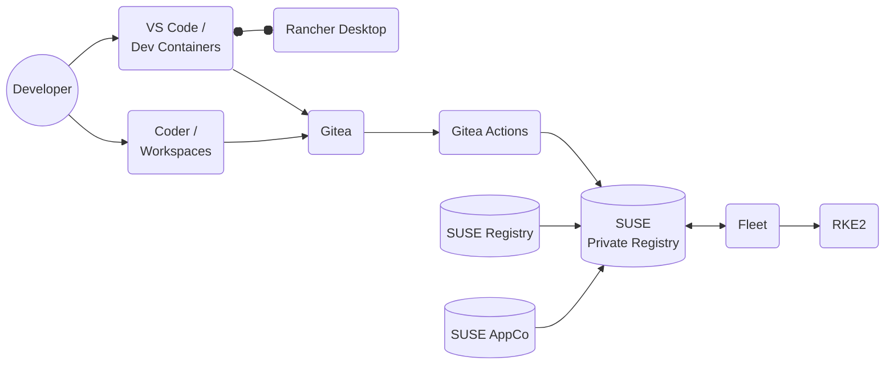

# SUSE DevEx Designs

This repository contains designs, documentation, automation scripts, and other
code artifacts for validated designs for end-to-end software development on SUSE
Rancher Prime. These designs will focus on developer ease of use, build and
deployment automation, security, and maintainability composed of SUSE Rancher
Prime components.

Some designs will use all SUSE components, others will rely on SUSE partner
solutions, and some will be a combination. 

Discussion about this initiative is currently happening in the
[#proj-devex](https://app.slack.com/client/T02863RC2AC/C088797UWCA) Slack
channel (SUSE internal).

## 1. GitAppOps - A composable, customizable, Git-centered workflow 

The first design (name TBD) is highly customizable but requires project-specific
configuration for each application. It makes the IDE and Git UI the center of the
Application Developer's experience. Build and deployment automation is managed
by Platform Engineers.

All container images / OCI artifacts can be stored centrally by the organization
in SUSE Private Registry, with base images and supporting applications coming
from SUSE Registry and SUSE Application Collection. 

## 2. Epinio - Lightweight Kubernetes-native PaaS

[Epinio](https://epinio.io/) is now developed, maintained and supported by
[Krumware](https://krum.io) in partnership with SUSE. This design provides a UI
and API specifically for app developers (independent of the source code control
used).

