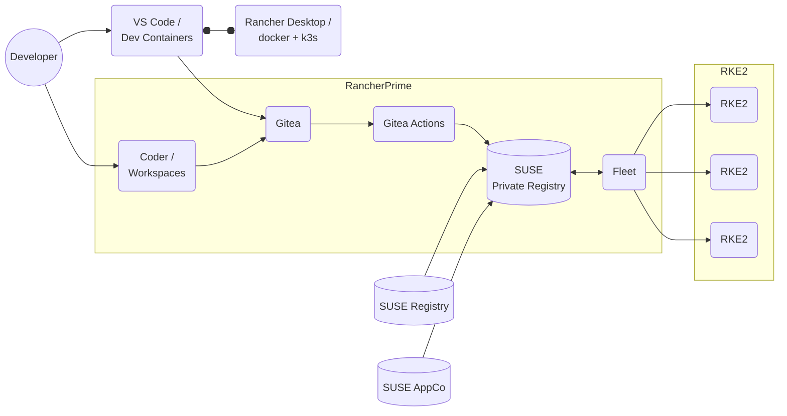
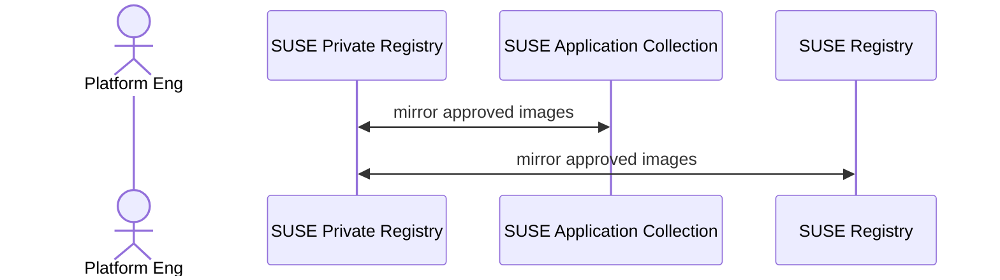
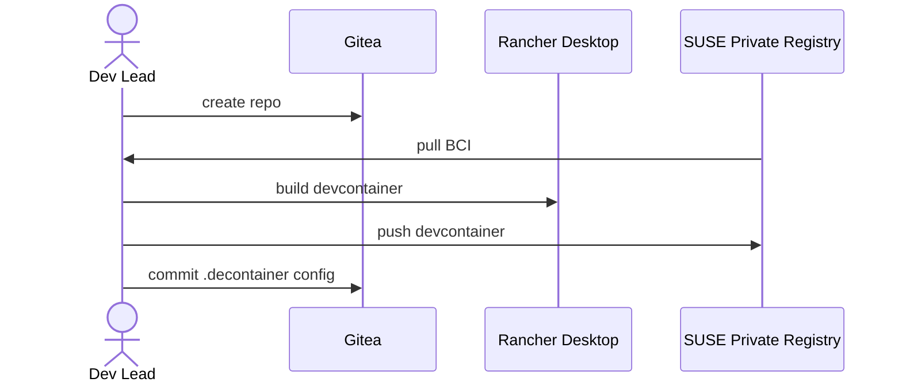
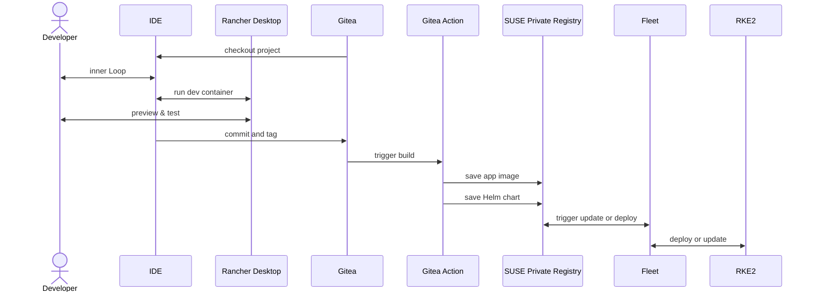

# GitOps for Rancher

The first design is highly customizable but requires project-specific
configuration for each application. It makes the IDE and Git UI the center of
the Application Developer's experience. Build and deployment automation is
managed by Platform Engineers.

All container images / OCI artifacts can be stored centrally by the organization
in SUSE Private Registry, with base images and supporting applications coming
from SUSE Registry and SUSE Application Collection.

## Choose and Mirror Trusted Images

This design is intended to enable secure-by-default pipelines for customers. To
keep the supply chain secure, the plaform admin takes on the responsibility of
ensuring that all OCI artifacts used by the development teams are centralized in
a registry their organization can control and audit. In this case, base
container images and packaged applications in development are sourced from SUSE
Application Collection or the SUSE Registry.

## App Project Setup

Developers or project leads will set up software projects in Git using the flow
methodology they prefer and the features available in their git UI of choice
(GitHub, GitLab, Gitea, etc.).

Adding [Development Containers](https://containers.dev/) configuration in the
project repo means that developers can have a self-contained development
environment running in a pre-configured container, right from their IDE.

[Rancher Desktop](https://rancherdesktop.io/) can provide the local Docker
(Moby) container runtime on Windows, Mac OS X, and Linux.

Rancher Desktop will also provide a local Kubernetes (K3s) environment for:

* running local data service instances using Helm charts or OCI
  images provided by SUSE Application Collection, fetched from the
  organization's private registry.
* testing Helm charts for the ultimate deployment of the app to Kubernetes

## Git* Actions

Developers will be able to build and test their code in their locally using Dev
Containers in Rancher Desktop, but ultimately they will be packaged and deployed
to Kubernetes.

Most git UIs offer some version of GitHub Actions functionality. Gitea uses a
fork of the [act](https://github.com/nektos/act) runner.

Creating custom actions for building and deployment responsibility on either the
Developer or Platform Engineer, but templates are available for many application
frameworks, and the format allows for extensive customization. This approach
requires more work up front than a Platform-as-a-Service approach using
off-the-shelf buildpacks, but allows more flexibility and gives more visibility
into the build process.

## Full GitApps Sequence

With the preparatory work done, a Developer should be able to start coding in a
project almost immediately after cloning the repository, using an IDE that [supports development containers](https://containers.dev/supporting#editors) or
a coding environment embedded in the platform itself (e.g. Coder).

Elements of this design can be substituted for extenral services as needed (e.g.
GitHub.com for a local git environment), but everything in the flow can be run
on SUSE Rancher Prime. This allows an organization to centralize control over
the entire code-to-cloud journey and track the entire software supply chain.

## Security Monitoring

Container and network security monitoring for the platform is provided by by [SUSE Security](https://documentation.suse.com/cloudnative/security/5.4/en/overview.html). Documentation on integrating this with GitOps for Rancher coming soon.

## Observability

Container observability and application debugging capabilities are provided by [SUSE Observability](https://docs.stackstate.com/). Documentation on integrating this with GitOps for Rancher coming soon.