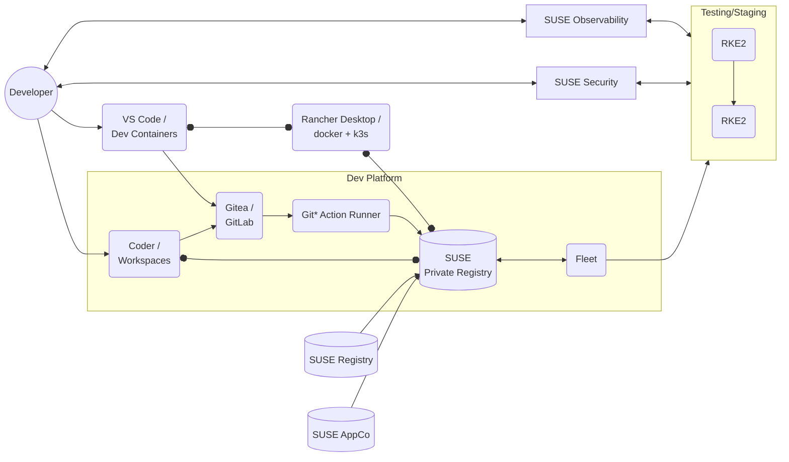

# SUSE DevX validated designs

This repository contains documentation, automation scripts, and other code
artifacts for validated designs enabling end-to-end software development on SUSE
Rancher Prime. These designs focus on developer ease of use, build automation,
continuous deployment, security, and maintainability.

Some designs will use SUSE Rancher Prime components, while others will
incorporate features available from SUSE certified partners.

Discussion about this initiative is currently happening in the SUSE [#proj-devx](https://app.slack.com/client/T02863RC2AC/C088797UWCA) Slack channel
(internal), but will expand to the wider SUSE Rancher community at and
after SUSECON 2025.

## 1. Rancher GitOps 

### A composable, customizable, Git-centered workflow

[GitOps for Rancher](gitops-overview.md) is a highly customizable
workflow, but requires project-specific configuration for each application. It
makes the IDE and Git UI the center of the Application Developer's experience.
Build and deployment automation is managed by Platform Engineers.

All container images / OCI artifacts can be stored centrally by the organization
in SUSE Private Registry, with base images and supporting applications coming
from SUSE Registry and SUSE Application Collection.

## 2. Epinio 

### Lightweight Kubernetes-native PaaS

[Epinio](https://epinio.io/) is now developed, maintained and supported by
[Krumware](https://www.krum.io) in partnership with SUSE. This design provides a UI
and API specifically for app developers (independent of the source code control
used).
